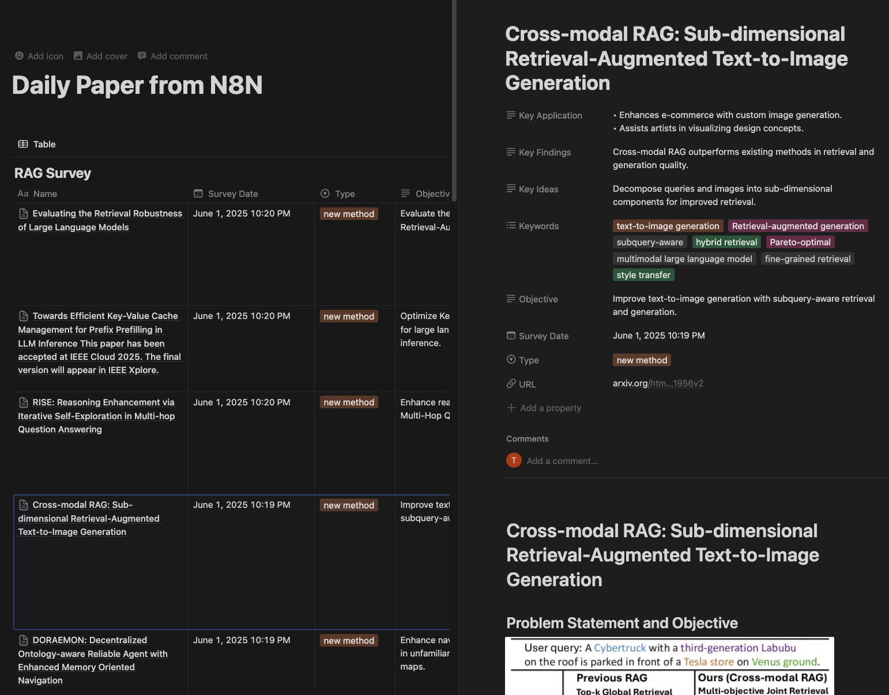

# Arxiv Summary with n8n

For an example of the results, please visit:

[https://kaput-process-ce2.notion.site/Daily-Paper-from-N8N-205badeb599580adbd8afd80b86ce303](https://kaput-process-ce2.notion.site/Daily-Paper-from-N8N-205badeb599580adbd8afd80b86ce303)



This workflow automates the process of:

1.) Searching for papers on Arxiv using your keyword

2.) Generating summaries of the papers

3.) Writing the summaries directly to Notion

# How to Use

1.) Run the workflow with Docker Compose:

```
docker-compose up
```

2.) Open your n8n instance in the browser. (localhost:5678)

3.) Import the workflow JSON file into n8n. (ctrl+c from workflow.json and ctrl+v in n8n workflow creation page)

4.) Update your API keys (e.g., OpenRouter, Notion) in the workflow credentials.

5.) Run the workflow to fetch papers, generate summaries, and save results to Notion automatically.

6.) Add logic to check if a paper has already been summarized and skip it if it exists in the Notion page.

## Todo

[] Add logic to check if a paper has already been summarized and skip it if it exists in the Notion page.
